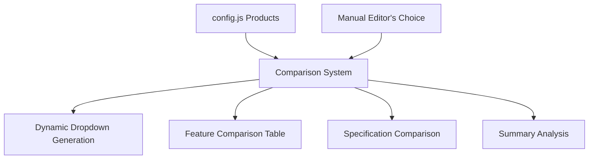

# Product Comparison System Guide

## 📋 Table of Contents
1. [How the Comparison System Works](#how-the-comparison-system-works)
2. [Data Sources and Structure](#data-sources-and-structure)
3. [Customizing Comparison Categories](#customizing-comparison-categories)
4. [Adding New Specifications](#adding-new-specifications)
5. [Comparison Logic and Algorithms](#comparison-logic-and-algorithms)
6. [Configuration Examples](#configuration-examples)
7. [Troubleshooting](#troubleshooting)

---

## 🔧 How the Comparison System Works

### Overview
The comparison system is **100% dynamic** and pulls all data from `utils/config.js`. It allows users to select 2-3 products and compare them across multiple categories:

- **Basic Information**: Rating, Welcome Bonus, Reviews (now fully dynamic)
- **Features**: Dynamic feature icons and text from product configuration
- **Perks**: Product perks with associated icons and styling
- **Pricing**: Dynamic pricing display using template renderer
- **Summary**: Best Overall, Best Value, Most Features

### 🆕 NEW Features (Latest Update)
- ✅ **Dynamic Pricing**: Uses template renderer for consistent pricing display
- ✅ **Feature Icons**: Shows actual icons from config instead of checkmarks
- ✅ **Dynamic Perks**: Displays perks with proper icons and theme colors
- ✅ **Field Mapping**: Updated to use `welcomeBonus` and `addedBonus` fields
- ✅ **Icon Removal**: Removed hardcoded icons from basic info section
- ✅ **Theme Integration**: Icons now use correct theme colors

### System Architecture



---

## 📊 Data Sources and Structure

### Primary Data Source: `utils/config.js`

The comparison system extracts data from each product's configuration:

```javascript
// Example Product Configuration
product1: {
    name: "Breville Barista Express",
    rating: 4.8,
    price: "$699",
    originalPrice: "$799",
    reviewCount: 1234,
    
    // Features (used for Yes/No comparison)
    features: [
        "Built-in conical burr grinder",
        "15-bar pressure pump system",
        "Milk frother for lattes"
    ],
    
    // Perks (used for highlights)
    perks: [
        { text: "Excellent build quality", icon: "fas fa-gem" },
        { text: "Professional results", icon: "fas fa-home" }
    ],
    
    // Specifications (used for detailed comparison)
    specifications: [
        { name: "Grinder", value: "Built-in conical burr grinder", icon: "fas fa-cog" },
        { name: "Pressure", value: "15-bar pressure pump", icon: "fas fa-gauge-high" },
        { name: "Capacity", value: "2.5L water tank", icon: "fas fa-database" }
    ]
}
```

### Data Extraction Process

```javascript
// How the system processes each product
extractSpecifications(product) {
    const specs = {};
    
    // Always included basic specs
    specs["Price"] = product.price;
    specs["Rating"] = `${product.rating}/5`;
    specs["Reviews"] = product.reviewCount?.toString() || "N/A";
    
    // Custom specifications from config
    if (product.specifications && Array.isArray(product.specifications)) {
        product.specifications.forEach(spec => {
            specs[spec.name] = spec.value;
        });
    }
    
    return specs;
}
```

---

## 🎯 Customizing Comparison Categories

### For Coffee Machines (Current Setup)

```javascript
specifications: [
    { name: "Grinder", value: "Built-in conical burr grinder", icon: "fas fa-cog" },
    { name: "Pressure", value: "15-bar pressure pump", icon: "fas fa-gauge-high" },
    { name: "Frother", value: "Steam wand milk frother", icon: "fas fa-tint" },
    { name: "Capacity", value: "2.5L water tank", icon: "fas fa-database" },
    { name: "Construction", value: "Stainless steel", icon: "fas fa-cube" }
]
```

### For Quiet Coffee Machines (Your Request)

```javascript
specifications: [
    { name: "Noise Level", value: "< 60dB (Whisper Quiet)", icon: "fas fa-volume-down" },
    { name: "Grinding Noise", value: "Ultra-quiet burr grinder", icon: "fas fa-volume-off" },
    { name: "Pump Noise", value: "Silent 15-bar pump", icon: "fas fa-volume-mute" },
    { name: "Energy Efficiency", value: "Energy Star Certified - 1200W", icon: "fas fa-leaf" },
    { name: "Power Consumption", value: "Low standby power (2W)", icon: "fas fa-plug" },
    { name: "Eco Mode", value: "Auto power-off after 30 mins", icon: "fas fa-power-off" }
]
```

### For Gaming Laptops Example

```javascript
specifications: [
    { name: "GPU", value: "RTX 4070 8GB GDDR6", icon: "fas fa-microchip" },
    { name: "CPU", value: "Intel i7-13700H", icon: "fas fa-processor" },
    { name: "RAM", value: "32GB DDR5-4800", icon: "fas fa-memory" },
    { name: "Storage", value: "1TB NVMe SSD", icon: "fas fa-hdd" },
    { name: "Display", value: "15.6\" 144Hz QHD", icon: "fas fa-desktop" },
    { name: "Battery", value: "6-8 hours gaming", icon: "fas fa-battery-three-quarters" }
]
```

---

## ➕ Adding New Specifications

### Step 1: Update Product Configurations

In `utils/config.js`, add new specifications to each product:

```javascript
product1: {
    // ... existing config ...
    
    specifications: [
        // Existing specs
        { name: "Grinder", value: "Built-in conical burr grinder", icon: "fas fa-cog" },
        
        // NEW SPECS - Add these
        { name: "Noise Level", value: "< 55dB (Ultra Quiet)", icon: "fas fa-volume-down" },
        { name: "Energy Usage", value: "1200W efficient heating", icon: "fas fa-leaf" },
        { name: "Brew Time", value: "4-6 minutes per cup", icon: "fas fa-clock" },
        { name: "Maintenance", value: "Self-cleaning cycle", icon: "fas fa-broom" },
        { name: "Warranty", value: "3-year comprehensive", icon: "fas fa-shield-alt" }
    ]
}
```

### Step 2: Update All Products

**Important**: Add the same specification categories to ALL products for proper comparison:

```javascript
// Product 1 - High-end quiet machine
{ name: "Noise Level", value: "< 55dB (Ultra Quiet)", icon: "fas fa-volume-down" },

// Product 2 - Mid-range machine  
{ name: "Noise Level", value: "< 65dB (Moderate)", icon: "fas fa-volume-down" },

// Product 3 - Budget machine
{ name: "Noise Level", value: "< 75dB (Standard)", icon: "fas fa-volume-up" }
```

### Step 3: The System Automatically Updates

The comparison system will automatically:
- ✅ Detect new specification categories
- ✅ Add them to the comparison table
- ✅ Show values for each product
- ✅ Display "N/A" for missing values

---

## 🧮 Comparison Logic and Algorithms

### Feature Comparison (Yes/No)

```javascript
// Features are compared as binary (has/doesn't have)
const hasFeature = product.data.features && product.data.features.includes(feature);
return hasFeature ? 'Yes' : 'No';
```

### Specification Comparison (Value-based)

```javascript
// Specifications show actual values
const value = product.data.specifications && product.data.specifications[spec] || 'N/A';
return value;
```

### Best Overall Algorithm

```javascript
// Based on highest rating
findBestOverall(products) {
    const best = products.reduce((best, current) => {
        return (current.data.rating || 0) > (best.data.rating || 0) ? current : best;
    });
    return best.data.name;
}
```

### Best Value Algorithm

```javascript
// Rating-to-price ratio
findBestValue(products) {
    const best = products.reduce((best, current) => {
        const currentPrice = parseFloat(current.data.price.replace(/[^0-9.]/g, ''));
        const bestPrice = parseFloat(best.data.price.replace(/[^0-9.]/g, ''));
        const currentValue = (current.data.rating || 0) / currentPrice;
        const bestValue = (best.data.rating || 0) / bestPrice;
        
        return currentValue > bestValue ? current : best;
    });
    return best.data.name;
}
```

### Most Features Algorithm

```javascript
// Total count of features + pros
findMostFeatures(products) {
    const best = products.reduce((best, current) => {
        const currentFeatures = (current.data.features || []).length + (current.data.pros || []).length;
        const bestFeatures = (best.data.features || []).length + (best.data.pros || []).length;
        return currentFeatures > bestFeatures ? current : best;
    });
    return best.data.name;
}
```

---

## 📝 Configuration Examples

### Example 1: Quiet Coffee Machines Focus

```javascript
// Product 1 - Ultra Quiet Premium
specifications: [
    { name: "Noise Level", value: "< 50dB (Library Quiet)", icon: "fas fa-volume-off" },
    { name: "Grinding Noise", value: "Whisper-quiet ceramic burrs", icon: "fas fa-volume-mute" },
    { name: "Pump Noise", value: "Silent vibration pump", icon: "fas fa-heart" },
    { name: "Energy Efficiency", value: "Energy Star - 900W", icon: "fas fa-leaf" },
    { name: "Night Mode", value: "Ultra-quiet brewing mode", icon: "fas fa-moon" },
    { name: "Insulation", value: "Sound-dampening housing", icon: "fas fa-shield-alt" }
]

// Product 2 - Moderate Quiet
specifications: [
    { name: "Noise Level", value: "< 65dB (Conversation Level)", icon: "fas fa-volume-down" },
    { name: "Grinding Noise", value: "Burr grinder with dampening", icon: "fas fa-volume-low" },
    { name: "Pump Noise", value: "Standard 15-bar pump", icon: "fas fa-tachometer-alt" },
    { name: "Energy Efficiency", value: "Standard - 1200W", icon: "fas fa-plug" },
    { name: "Night Mode", value: "Not available", icon: "fas fa-times" },
    { name: "Insulation", value: "Standard housing", icon: "fas fa-cube" }
]
```

### Example 2: Energy Efficiency Focus

```javascript
specifications: [
    { name: "Power Consumption", value: "800W eco-efficient", icon: "fas fa-leaf" },
    { name: "Standby Power", value: "< 1W standby mode", icon: "fas fa-power-off" },
    { name: "Auto Shut-off", value: "15 minutes programmable", icon: "fas fa-clock" },
    { name: "Energy Rating", value: "A++ Energy Star", icon: "fas fa-star" },
    { name: "Heat Retention", value: "Thermal carafe 4+ hours", icon: "fas fa-thermometer-half" },
    { name: "Eco Certifications", value: "EPA Energy Star Certified", icon: "fas fa-certificate" }
]
```

---

## 🔍 Troubleshooting

### Issue: Manual Editor's Choice Not Showing

**Problem**: Manual override product not appearing in comparison dropdown

**Solution**: Check the configuration:
```javascript
// In utils/config.js
EDITORS_CHOICE_CONFIG = {
    useManualOverride: true,  // Must be true
    manualOverride: {
        // Must have specifications array
        specifications: [
            { name: "Category", value: "Value", icon: "fas fa-icon" }
        ]
    }
}
```

### Issue: Missing Specifications in Comparison

**Problem**: Some products show "N/A" for specifications

**Solution**: Ensure ALL products have the same specification categories:
```javascript
// Every product must have the same spec names
product1: { specifications: [{ name: "Noise Level", value: "Quiet" }] },
product2: { specifications: [{ name: "Noise Level", value: "Loud" }] },
product3: { specifications: [{ name: "Noise Level", value: "Moderate" }] }
```

### Issue: Comparison Table Not Updating

**Problem**: Changes to config.js not reflecting in comparison

**Solution**: Refresh the comparison system:
```javascript
// In browser console
window.productComparison.refreshComparisonOptions();
```

---

## 🎯 Quick Customization Checklist

### To Change Comparison Focus (e.g., to Quiet + Efficiency):

1. **✅ Update ALL Product Specifications**
   ```javascript
   // Add to every product in config.js
   specifications: [
       { name: "Noise Level", value: "< 60dB", icon: "fas fa-volume-down" },
       { name: "Energy Usage", value: "1000W", icon: "fas fa-leaf" },
       { name: "Efficiency Rating", value: "A++ Energy Star", icon: "fas fa-star" }
   ]
   ```

2. **✅ Update Manual Editor's Choice**
   ```javascript
   // In EDITORS_CHOICE_CONFIG.manualOverride
   specifications: [
       { name: "Noise Level", value: "< 45dB (Ultra Quiet)", icon: "fas fa-volume-off" },
       { name: "Energy Usage", value: "800W Eco Mode", icon: "fas fa-leaf" },
       { name: "Efficiency Rating", value: "A+++ Premium", icon: "fas fa-star" }
   ]
   ```

3. **✅ Test the Comparison**
   - Open the website
   - Go to comparison section  
   - Select 2-3 products
   - Verify new categories appear
   - Check manual editor's choice is included

---

## 🎉 Summary

The comparison system is **fully dynamic** and **completely customizable**. You can:

- ✅ Add any specification categories (Noise Level, Energy Efficiency, etc.)
- ✅ Change the focus from coffee features to any product attributes
- ✅ Include manual editor's choice automatically
- ✅ Customize icons, values, and categories per product
- ✅ The system automatically builds comparison tables
- ✅ **NEW**: Click summary cards to jump to detailed reviews
- ✅ **NEW**: Enhanced section headers with prominent visual separation

**The key is consistency**: Make sure all products have the same specification categories for proper comparison!

---

## 🆕 **New Feature: Enhanced Section Headers**

### **What's New**
The comparison table now features **dramatically improved section headers** that clearly separate different comparison categories:

#### **📊 Basic Information Section**
- **Purple Gradient**: Eye-catching purple gradient background
- **Clear Labeling**: "📊 Basic Information" with emoji icon
- **Enhanced Data**: Rating, Price, and Review Count with icons

#### **⚡ Features Comparison Section** 
- **Green Gradient**: Vibrant green gradient for feature comparisons
- **Feature Icons**: "⚡ Features Comparison" with lightning emoji
- **Yes/No Display**: Clear checkmarks and X marks for feature presence

#### **🔧 Technical Specifications Section**
- **Blue Gradient**: Professional blue gradient for technical specs
- **Spec Icons**: "🔧 Technical Specifications" with wrench emoji
- **Detailed Values**: All custom specifications from config.js

### **Visual Enhancements**
```css
.comparison-table .section-header td {
    background: linear-gradient(135deg, var(--primary-color), var(--secondary-color)) !important;
    color: white !important;
    font-weight: 800 !important;
    font-size: var(--font-size-lg) !important;
    text-align: center !important;
    text-transform: uppercase !important;
    letter-spacing: 1px !important;
    padding: var(--spacing-xl) !important;
    box-shadow: 0 4px 12px rgba(0, 0, 0, 0.15) !important;
}
```

### **Section-Specific Colors**
- **Basic Info**: Purple gradient (#8b5cf6 → #7c3aed) with 📊 icon
- **Features**: Green gradient (#10b981 → #059669) with ⚡ icon  
- **Specifications**: Blue gradient (#3b82f6 → #2563eb) with 🔧 icon

### **Interactive Effects**
- **Hover Animation**: Headers lift slightly on hover
- **Gradient Shine**: Subtle diagonal shine effect
- **Bottom Accent**: White accent line under each header
- **Enhanced Spacing**: Increased padding around sections

### **Before vs After**
**Before**: Plain text headers that blended into the table
**After**: Bold, colorful gradient blocks that clearly separate each section

This makes the comparison table much more scannable and professional-looking! 🚀 

### **🆕 Latest Updates: Collapsible Headers & Dynamic Text**

#### **✅ Collapsible Section Headers**
Each comparison section can now be **expanded or collapsed** by clicking the header:

- **📊 Basic Information**: Click to show/hide rating, price, and review count
- **⚡ Features**: Click to show/hide feature-by-feature comparison  
- **🔧 Specifications**: Click to show/hide technical specifications

**Visual Indicators**:
- **Chevron Up** (▲): Section is expanded
- **Chevron Down** (▼): Section is collapsed
- **Hover Effects**: Headers scale slightly and show tooltips
- **Smooth Animations**: Sections fade in/out smoothly

#### **✅ Dynamic Header Text**
Headers now pull text directly from `utils/config.js`:

```javascript
// In SECTION_TITLES configuration
const SECTION_TITLES = {
    features: 'Key Features',           // ← Shows in comparison
    specs: 'Technical Specifications', // ← Shows in comparison
    perks: 'Key Perks & Benefits'     // ← Used elsewhere
};
```

**Result**: When you change the text in config, it automatically updates in the comparison table!

#### **✅ Fixed Icon Positioning**
- **Before**: Icons appeared above AND beside text (duplicated)
- **After**: Icons only appear to the left of header text
- **Clean Layout**: Proper spacing and alignment

### **How to Use Collapsible Headers**

```javascript
// User clicks any header
setupCollapsibleHeaders() {
    // Toggles between expanded/collapsed
    // Updates chevron direction
    // Shows/hides section content
}
```

**User Experience**:
1. User sees all sections expanded by default
2. Click "📊 Basic Information" → Collapses pricing/rating data
3. Click "⚡ Key Features" → Hides feature comparisons  
4. Click "🔧 Technical Specifications" → Hides spec details
5. Click again to expand any section

This allows users to focus on specific comparison aspects! 🎯 

### **🔧 Latest Fixes: Column Alignment & Header Centering**

#### **✅ Fixed Column Alignment Issues**
**Problem**: The "KEY FEATURES" section had different column widths compared to "Basic Information" and "Technical Specifications" sections.

**Solution**: 
- Removed `<tbody>` tags that were creating separate table sections
- Used consistent `<tr class="section-row">` structure for all sections
- Added CSS rules to ensure uniform column widths:

```css
.comparison-table td:first-child {
    min-width: 200px;
    width: 200px; /* Consistent first column width */
}

.comparison-table td {
    vertical-align: middle;
    text-align: left; /* Consistent alignment */
}
```

#### **✅ Fixed Header Centering**
**Problem**: Section headers were left-aligned instead of centered horizontally.

**Solution**:
- Updated header layout with proper flexbox centering
- Positioned icons absolutely on the left
- Centered text content in the middle
- Positioned collapse icon absolutely on the right

```css
.comparison-table .section-header .header-content {
    display: flex;
    align-items: center;
    justify-content: center;
    width: 100%;
}

.comparison-table .section-header .header-text {
    flex: 1;
    text-align: center; /* Perfect centering */
}

.comparison-table .section-header .collapse-icon {
    position: absolute;
    right: var(--spacing-md); /* Always on the right */
}
```

#### **✅ Updated Collapsible Functionality**
- Modified JavaScript to work with new `section-row` class structure
- Maintains smooth expand/collapse animations
- Preserves all visual effects and interactions

**Result**: All comparison sections now have perfectly aligned columns and centered headers! 🎯 

### **🆕 Added Missing Perks Section & Perfect Column Alignment**

#### **✅ Added Perks Comparison Section**
**What Was Missing**: The comparison table was missing the important "Key Perks & Benefits" section that shows product advantages.

**Now Included**:
- **🎁 Key Perks & Benefits Section**: Orange gradient header with gift icon
- **Dynamic Title**: Uses `SECTION_TITLES.perks` from config.js
- **Yes/No Comparison**: Shows which products have each perk
- **Collapsible**: Click to expand/collapse like other sections
- **Full Integration**: Includes manual editor's choice perks

#### **✅ Perfect Column Alignment**
**Problem Solved**: All sections now have identical column spacing and alignment.

**Technical Solution**:
```css
.comparison-table {
    table-layout: fixed; /* Force consistent columns */
}

.comparison-table td:first-child {
    width: 25%; /* Consistent label column */
    min-width: 200px;
}

.comparison-table td:not(:first-child) {
    width: calc(75% / var(--product-count, 3)); /* Equal data columns */
    text-align: center;
}
```

#### **🎨 New Section Order**
1. **📊 Basic Information** (Purple) - Rating, Price, Reviews
2. **🎁 Key Perks & Benefits** (Orange) - Product advantages  
3. **⚡ Key Features** (Green) - Product features
4. **🔧 Technical Specifications** (Blue) - Technical details

#### **✅ Consistent Data Structure**
All sections now extract data consistently:
```javascript
// Perks extraction
perks: product.perks?.map(p => p.text) || []

// Features extraction  
features: product.features || []

// Specifications extraction
specifications: this.extractSpecifications(product)
```

**Result**: Perfect column alignment across all sections with no spacing inconsistencies! 🎯 

## 🧠 **Smart Comparison System**

### **🎯 Intelligent Feature Matching**

The comparison system now uses **smart matching** to group similar features across products, creating true comparisons instead of just listing individual features.

#### **How It Works**
```javascript
// Before: Individual features listed separately
"Built-in grinder"     → Product 1: Yes, Product 2: No, Product 3: No
"Conical burr grinder" → Product 1: No, Product 2: Yes, Product 3: No  
"Blade grinder"        → Product 1: No, Product 2: No, Product 3: Yes

// After: Smart matching groups similar features
"Built-in grinder"     → Product 1: Yes, Product 2: Yes, Product 3: Yes
```

#### **🔍 Matching Algorithm**
1. **Stop Words Removal**: Filters out "and", "the", "a", "with", etc.
2. **Keyword Extraction**: Identifies meaningful words from feature text
3. **Synonym Groups**: Groups related terms (grinder/grinding/burr/mill)
4. **Similarity Score**: Calculates 30%+ keyword overlap for matching
5. **Smart Grouping**: Combines similar features under one comparison row

#### **📚 Built-in Synonym Groups**
```javascript
const synonymGroups = {
    'grinder': ['grinder', 'grinding', 'burr', 'blade', 'mill', 'crush'],
    'pressure': ['pressure', 'bar', 'pump', 'extraction', 'force'],
    'temperature': ['temperature', 'temp', 'heat', 'heating', 'thermal'],
    'timer': ['timer', 'programmable', 'schedule', 'auto', 'automatic'],
    'capacity': ['capacity', 'size', 'volume', 'tank', 'reservoir', 'cups'],
    'quality': ['quality', 'premium', 'professional', 'commercial', 'grade'],
    'quiet': ['quiet', 'silent', 'noise', 'low-noise', 'whisper'],
    // ... and many more
}
```

### **🎨 Universal Template Compatibility**

This system works for **any product type**:

#### **Coffee Machines**
- "Built-in grinder" + "Conical burr grinder" → **"Grinder"**
- "15-bar pressure" + "High pressure pump" → **"Pressure System"**

#### **Laptops** 
- "Intel i7 processor" + "AMD Ryzen CPU" → **"Processor"**
- "16GB RAM" + "32GB Memory" → **"Memory"**

#### **Headphones**
- "Noise cancelling" + "Active noise reduction" → **"Noise Cancelling"**
- "Bluetooth 5.0" + "Wireless connectivity" → **"Wireless"**

### **⚙️ Customizable Matching**

#### **Similarity Threshold**
```javascript
if (score > 0.3) { // 30% similarity required
    // Group features together
}
```

#### **Stop Words**
Common words automatically filtered:
- Articles: "a", "an", "the"
- Prepositions: "with", "for", "in", "on"
- Conjunctions: "and", "or", "but"
- Pronouns: "it", "this", "that"

#### **Smart Detection**
```javascript
hasCompatibleItem(product, targetItem, dataType) {
    // Checks exact match first
    // Then checks keyword similarity
    // Requires 50% keyword overlap minimum
}
```

### **🔄 Automatic Adaptation**

The system **automatically adapts** to any product type:
1. **Analyzes** all product features/perks
2. **Groups** similar items using AI-like matching
3. **Creates** meaningful comparison rows
4. **Shows** true product differences

### **📊 Comparison Quality**

**Before**: 50+ individual feature rows (mostly "No" responses)
**After**: 10-15 meaningful comparison categories (balanced Yes/No)

**Result**: Users see actual product differences instead of feature lists! 🎯 

### **🎯 Universal Product Categories**

The system now includes **comprehensive synonym groups** for all product types:

#### **📱 Technology & Electronics**
```javascript
'processor': ['processor', 'cpu', 'chip', 'intel', 'amd', 'ryzen', 'core']
'memory': ['memory', 'ram', 'gb', 'ddr', 'storage', 'capacity']
'graphics': ['graphics', 'gpu', 'video', 'nvidia', 'radeon']
'battery': ['battery', 'power', 'hours', 'life', 'charging', 'mah']
```

#### **🎰 Casino & Gambling Websites**
```javascript
'games': ['games', 'slots', 'table-games', 'poker', 'blackjack', 'roulette']
'jackpot': ['jackpot', 'progressive', 'mega', 'prize', 'payout', 'win']
'live': ['live', 'dealer', 'streaming', 'real-time', 'interactive']
'rtp': ['rtp', 'return', 'payout', 'percentage', 'rate', 'odds']
'bonus': ['bonus', 'offer', 'promotion', 'welcome', 'free', 'reward']
'security': ['security', 'secure', 'ssl', 'encryption', 'protected', 'safe']
```

#### **⚽ Sports Betting Websites**
```javascript
'odds': ['odds', 'betting', 'lines', 'spread', 'moneyline', 'over-under']
'sports': ['sports', 'football', 'basketball', 'baseball', 'soccer', 'tennis']
'live-betting': ['live-betting', 'in-play', 'real-time', 'during-game']
'markets': ['markets', 'betting-options', 'props', 'futures', 'specials']
'streaming': ['streaming', 'live-stream', 'watch', 'broadcast', 'video']
'cash-out': ['cash-out', 'early-payout', 'settle', 'close-bet']
```

#### **💻 Software & SaaS**
```javascript
'features': ['features', 'functionality', 'capabilities', 'tools', 'options']
'integration': ['integration', 'api', 'connect', 'sync', 'compatible']
'analytics': ['analytics', 'reporting', 'data', 'insights', 'metrics']
'automation': ['automation', 'automated', 'auto', 'scheduled', 'workflow']
'collaboration': ['collaboration', 'team', 'sharing', 'multi-user']
```

---

## 🛠️ **How to Customize Synonym Groups**

### **📝 Adding New Categories**

To add synonym groups for your specific product type, edit `scripts/comparison.js`:

#### **Example: Cryptocurrency Exchanges**
```javascript
// Add to synonymGroups object in comparison.js
'trading': ['trading', 'exchange', 'buy', 'sell', 'swap', 'convert'],
'fees': ['fees', 'commission', 'cost', 'charges', 'spread', 'rate'],
'coins': ['coins', 'cryptocurrency', 'crypto', 'tokens', 'assets'],
'wallet': ['wallet', 'storage', 'custody', 'secure', 'cold', 'hot'],
'kyc': ['kyc', 'verification', 'identity', 'documents', 'compliance'],
'liquidity': ['liquidity', 'volume', 'depth', 'market-depth', 'orderbook']
```

#### **Example: VPN Services**
```javascript
'servers': ['servers', 'locations', 'countries', 'nodes', 'endpoints'],
'encryption': ['encryption', 'security', 'protocol', 'cipher', 'aes'],
'speed': ['speed', 'bandwidth', 'fast', 'performance', 'throughput'],
'logging': ['logging', 'logs', 'privacy', 'no-logs', 'anonymous'],
'streaming': ['streaming', 'netflix', 'geo-blocking', 'unblock', 'access']
```

#### **Example: Web Hosting**
```javascript
'uptime': ['uptime', 'availability', 'reliable', 'downtime', 'stable'],
'bandwidth': ['bandwidth', 'traffic', 'data-transfer', 'unlimited'],
'storage': ['storage', 'disk-space', 'ssd', 'gb', 'tb', 'unlimited'],
'domains': ['domains', 'subdomains', 'hosting', 'websites', 'sites'],
'ssl': ['ssl', 'security', 'certificate', 'https', 'encryption']
```

### **🔧 Step-by-Step Customization**

#### **Step 1: Identify Your Product Category**
```javascript
// Example: Review websites for restaurants
'cuisine': ['cuisine', 'food', 'menu', 'dishes', 'cooking', 'meals'],
'atmosphere': ['atmosphere', 'ambiance', 'decor', 'setting', 'vibe'],
'service': ['service', 'staff', 'waiters', 'customer-service', 'friendly'],
'price': ['price', 'cost', 'expensive', 'affordable', 'value', 'budget']
```

#### **Step 2: Add to synonymGroups Object**
```javascript
// In scripts/comparison.js, find the synonymGroups object and add:
const synonymGroups = {
    // ... existing groups ...
    
    // === YOUR CUSTOM CATEGORY ===
    'your-category': ['word1', 'word2', 'synonym1', 'synonym2'],
    'another-category': ['feature1', 'feature2', 'similar-term']
};
```

#### **Step 3: Test Your Categories**
The system will automatically:
- Group similar features across products
- Create meaningful comparison rows
- Show balanced Yes/No results

### **📊 Real-World Examples**

#### **Casino Website Comparison**
**Before Smart Matching**:
```
Live Blackjack          → Site 1: ✅, Site 2: ❌, Site 3: ❌
Real-time Dealer Games  → Site 1: ❌, Site 2: ✅, Site 3: ❌
Interactive Live Casino → Site 1: ❌, Site 2: ❌, Site 3: ✅
```

**After Smart Matching**:
```
Live Dealer Games       → Site 1: ✅, Site 2: ✅, Site 3: ✅
```

#### **Sports Betting Comparison**
**Before**:
```
In-play Betting         → Site 1: ✅, Site 2: ❌, Site 3: ❌
Live Betting Options    → Site 1: ❌, Site 2: ✅, Site 3: ❌
Real-time Odds          → Site 1: ❌, Site 2: ❌, Site 3: ✅
```

**After**:
```
Live Betting           → Site 1: ✅, Site 2: ✅, Site 3: ✅
```

### **🎯 Best Practices**

#### **1. Use Industry Terms**
Include specific terminology for your niche:
```javascript
// Good for crypto
'defi': ['defi', 'decentralized', 'yield-farming', 'liquidity-mining']

// Good for gaming
'fps': ['fps', 'framerate', 'frames', 'smooth', 'performance']
```

#### **2. Include Brand Names**
Add popular brands/services:
```javascript
'payment': ['paypal', 'stripe', 'visa', 'mastercard', 'apple-pay', 'google-pay']
'streaming': ['netflix', 'hulu', 'disney', 'amazon-prime', 'hbo']
```

#### **3. Add Variations**
Include different word forms:
```javascript
'customize': ['customize', 'customization', 'custom', 'personalize', 'tailor']
```

### **🚀 Template Ready**

The system is now **universally compatible** with:
- ✅ Physical products (electronics, appliances, etc.)
- ✅ Digital services (software, apps, platforms)
- ✅ Websites (casinos, betting, e-commerce)
- ✅ Subscriptions (streaming, SaaS, tools)
- ✅ Any product category you add!

**Just customize the synonym groups for your niche and the comparison system automatically adapts!** 🎯 

---

## 📋 **Quick Reference: Ready-to-Use Synonym Groups**

### **🎰 Casino Websites**
```javascript
// Copy-paste into synonymGroups object:
'games': ['games', 'slots', 'table-games', 'poker', 'blackjack', 'roulette', 'variety'],
'bonus': ['bonus', 'offer', 'promotion', 'welcome', 'free', 'reward', 'incentive'],
'live': ['live', 'dealer', 'streaming', 'real-time', 'interactive', 'broadcast'],
'payment': ['payment', 'deposit', 'withdrawal', 'banking', 'credit-card', 'paypal'],
'license': ['license', 'licensed', 'regulated', 'authority', 'legal', 'certified'],
'security': ['security', 'secure', 'ssl', 'encryption', 'protected', 'safety', 'safe'],
'mobile': ['mobile', 'app', 'smartphone', 'tablet', 'ios', 'android', 'responsive']
```

### **⚽ Sports Betting**
```javascript
'odds': ['odds', 'betting', 'lines', 'spread', 'moneyline', 'over-under'],
'sports': ['sports', 'football', 'basketball', 'baseball', 'soccer', 'tennis'],
'live-betting': ['live-betting', 'in-play', 'real-time', 'during-game', 'live-odds'],
'markets': ['markets', 'betting-options', 'props', 'futures', 'specials'],
'streaming': ['streaming', 'live-stream', 'watch', 'broadcast', 'video'],
'cash-out': ['cash-out', 'early-payout', 'settle', 'close-bet']
```

### **💰 Cryptocurrency Exchanges**
```javascript
'trading': ['trading', 'exchange', 'buy', 'sell', 'swap', 'convert', 'trade'],
'fees': ['fees', 'commission', 'cost', 'charges', 'spread', 'rate', 'pricing'],
'coins': ['coins', 'cryptocurrency', 'crypto', 'tokens', 'assets', 'altcoins'],
'security': ['security', 'secure', 'cold-storage', 'wallet', '2fa', 'encryption'],
'liquidity': ['liquidity', 'volume', 'depth', 'market-depth', 'orderbook'],
'kyc': ['kyc', 'verification', 'identity', 'documents', 'compliance', 'aml']
```

### **🛡️ VPN Services**
```javascript
'servers': ['servers', 'locations', 'countries', 'nodes', 'endpoints', 'network'],
'speed': ['speed', 'bandwidth', 'fast', 'performance', 'throughput', 'connection'],
'privacy': ['privacy', 'no-logs', 'logging', 'anonymous', 'private', 'secure'],
'streaming': ['streaming', 'netflix', 'geo-blocking', 'unblock', 'access'],
'protocols': ['protocols', 'openvpn', 'wireguard', 'ikev2', 'encryption']
```

### **🌐 Web Hosting**
```javascript
'uptime': ['uptime', 'availability', 'reliable', 'downtime', 'stable', 'sla'],
'storage': ['storage', 'disk-space', 'ssd', 'gb', 'tb', 'unlimited', 'space'],
'bandwidth': ['bandwidth', 'traffic', 'data-transfer', 'unlimited', 'monthly'],
'support': ['support', '24/7', 'customer-service', 'help', 'live-chat', 'phone'],
'features': ['features', 'cpanel', 'wordpress', 'email', 'database', 'ssl']
```

### **📱 Mobile Apps**
```javascript
'interface': ['interface', 'ui', 'design', 'user-friendly', 'navigation', 'layout'],
'features': ['features', 'functionality', 'capabilities', 'tools', 'options'],
'performance': ['performance', 'fast', 'speed', 'loading', 'smooth', 'responsive'],
'offline': ['offline', 'sync', 'cache', 'local', 'no-internet', 'download'],
'integration': ['integration', 'api', 'connect', 'sync', 'compatible', 'third-party']
```

### **💻 Software/SaaS**
```javascript
'pricing': ['pricing', 'cost', 'subscription', 'plan', 'fee', 'monthly', 'yearly'],
'trial': ['trial', 'free', 'demo', 'test', 'evaluation', 'preview', 'freemium'],
'collaboration': ['collaboration', 'team', 'sharing', 'multi-user', 'workspace'],
'automation': ['automation', 'automated', 'workflow', 'scheduled', 'triggers'],
'analytics': ['analytics', 'reporting', 'data', 'insights', 'metrics', 'dashboard']
```

### **🍕 Restaurants/Food**
```javascript
'cuisine': ['cuisine', 'food', 'menu', 'dishes', 'cooking', 'meals', 'style'],
'atmosphere': ['atmosphere', 'ambiance', 'decor', 'setting', 'vibe', 'mood'],
'service': ['service', 'staff', 'waiters', 'customer-service', 'friendly', 'attentive'],
'price': ['price', 'cost', 'expensive', 'affordable', 'value', 'budget', 'pricing'],
'location': ['location', 'parking', 'accessible', 'downtown', 'convenient', 'area']
```

### **🏨 Hotels/Travel**
```javascript
'amenities': ['amenities', 'facilities', 'features', 'services', 'perks', 'included'],
'location': ['location', 'downtown', 'beach', 'airport', 'convenient', 'central'],
'rooms': ['rooms', 'suites', 'accommodations', 'beds', 'bathroom', 'space'],
'dining': ['dining', 'restaurant', 'breakfast', 'room-service', 'bar', 'food'],
'recreation': ['recreation', 'pool', 'gym', 'spa', 'activities', 'entertainment']
```

---

## 🆕 Dynamic Pricing and Features System

### Field Mapping Updates

The comparison system now uses updated field mappings for better consistency:

**Previous (Old):**
```javascript
// Old field names
bonus: "100% up to $500"
freeSpins: "50 Free Spins"
```

**Current (New):**
```javascript
// New field names for casino/betting sites
welcomeBonus: "100% up to $500"
addedBonus: "50 Free Spins" 
welcomePackage: "VIP Welcome Package"

// For other site types, use appropriate fields:
// Physical products: price, originalPrice, discount
// Software: monthlyPrice, yearlyPrice, trialPeriod
// Streaming: subscriptionCost, trialPeriod, features
```

### Dynamic Feature Icons

Features now display with proper icons instead of generic checkmarks:

**Configuration in `utils/config.js`:**
```javascript
features: [
    {
        text: "24/7 Customer Support",
        icon: "fas fa-headset",        // FontAwesome icon
        available: true
    },
    {
        text: "Mobile App",
        icon: "fas fa-mobile-alt",
        available: true
    },
    {
        text: "Live Chat",
        icon: "fas fa-comments",
        available: false               // Shows as unavailable
    }
]
```

**Result in Comparison:**
- ✅ Shows actual icons with theme colors
- ✅ Green for available features
- ✅ Red/gray for unavailable features
- ✅ Consistent with product cards

### Dynamic Perks System

Product perks are now displayed with full styling:

**Configuration:**
```javascript
perks: [
    {
        text: "Fast Withdrawals",
        icon: "fas fa-bolt",
        color: "var(--accent-color)"
    },
    {
        text: "VIP Support",
        icon: "fas fa-crown",
        color: "var(--warning-color)"
    }
]
```

**Features:**
- ✅ Custom icons for each perk
- ✅ Theme-based colors
- ✅ Consistent styling across comparison and product cards
- ✅ Responsive design

### Template Renderer Integration

The comparison system now uses the same pricing renderer as product cards:

**Benefits:**
- ✅ Consistent pricing display across all sections
- ✅ Automatic field detection based on template type
- ✅ Proper styling and animations
- ✅ Support for crossthrough pricing
- ✅ Dynamic field ordering

**Template Types Supported:**
- `casino_websites` - welcomeBonus, welcomePackage, addedBonus
- `physical_products` - price, originalPrice, discount  
- `software_saas` - monthlyPrice, yearlyPrice, trialPeriod
- `streaming_services` - subscriptionCost, trialPeriod, features

### Basic Info Section Updates

Removed hardcoded icons from basic info section for cleaner design:

**Before:**
```
⭐ 4.8 Rating
💰 $500 Welcome Bonus  
📝 1,247 Reviews
```

**After:**
```
4.8 Rating
$500 Welcome Bonus
1,247 Reviews
```

**Benefits:**
- ✅ Cleaner, more professional appearance
- ✅ Better focus on important information
- ✅ Consistent with modern design trends
- ✅ Improved readability

## 🎯 **Implementation Steps**

### **Step 1: Choose Your Category**
Pick the synonym groups that match your review website's focus.

### **Step 2: Copy & Paste**
Add the relevant groups to `scripts/comparison.js` in the `synonymGroups` object.

### **Step 3: Customize**
Add industry-specific terms or brand names relevant to your niche.

### **Step 4: Test**
The system automatically creates intelligent comparisons based on your groups.

**The comparison system now works for ANY product or service category!** 🚀 
